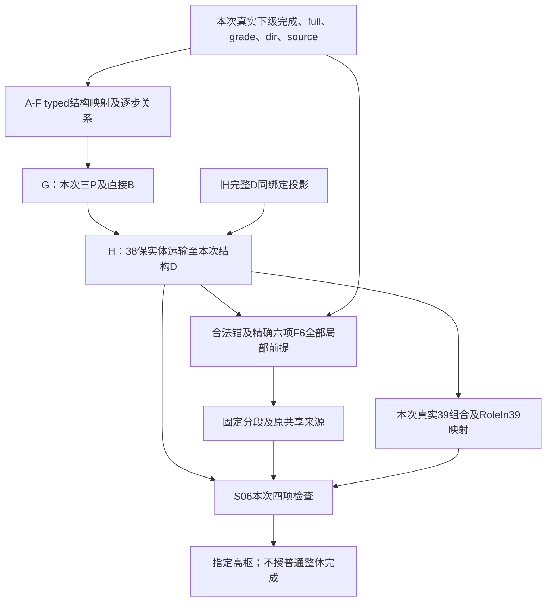

# F2合同补丁提案：54 typed结构来源与结构D消费（v2）

日期：2026-10-05。状态：结构合同与下级输入构造两路独审已有限签收，本文最小补充经父级核对通过；签收仅限所列条件纸面构造及有限结构规则，正式接口未启用。提交前基线HEAD为 `7bd6c801f8e07743e5e26a2d88b9ce3a6d070898`。v1的历史事件限定撤回；本稿不改现行主合同或已发表研究结论。

## 1. 规则来源、实例域及不扩展的范围

依据[本线九项稿§3.2.1](F2九项种子研究-a0准确完成分支.md)、[结构D读集稿](F2结构D与39外角色-九项右部读集审计.md)及[Slack54固定稿](https://github.com/forex24/chan-doc/blob/487dcd827f6acefad3ed343d9a410c1fafe160dc/docs/F2独立研究-slack-54课联合重组与结构D初始化.md)，后者blob为 `8b3389c4c6772bbb93cb38ffd50e757ccdc4f05e`。这些发表范围不等于本补丁已获批准。

[54正文](../原文/chzhshch-108-plus/108/0535-486e105c01000arw-054.md)L17说明两等式有无不影响分析，L61要求按标准分析图形；[35](../原文/chzhshch-108-plus/108/0475-486e105c01000914-035.md)／[36](../原文/chzhshch-108-plus/108/0478-486e105c0100093a-036.md)给出递归结合，[84](../原文/chzhshch-108-plus/108/0718-486e105c01000cx4-084.md)区分不可重复行情与可复制结构。故2007原行情身份不是54方法前提；原始数据重放可以是一个实例，不能成为唯一入口。

本补丁申请的是54第一读法的严格typed图式特化：价格域、完成层级、形成／连接角色和逐步重组全部按§2—3验证。不同市场可以各自产生实例，不限定正仿射变换；同价或仅保价格次序仍不足。去两等式、第二读法、镜像、一般混级、未知full与更广角色域暂不接纳。

54 L25的式子标题写g0g3，而右式实际止于d3；本稿只使用准确末端d3的重括号，不借该标题延长owned。L29的力度不等式不是价格序，本结构规则不读取MACD／力度，不输出盘背或背驰点。

## 2. A—E：本次实际来源、层级及数值前提

A. 在同一实际source域及选定I内，u0…u9各有可信最低／下级完成producer。逐项保留grade、type、dir、owned、full、κ及仍影响联合的残余依赖。不是把十个ExistsComplete边际拼在一起，也不是一张Author54Cert。

B. 符号市场位置到本次真实位置的映射单射并严格保序：
`g0,d1,g1,d2,g2,d3,g3,d4,g4,d5,g5`。
相邻owned首尾相接，不拆项、不重复分配；价位相等不合并位置。确认尾只入证据关系，不进入历史owned。

C. 实际层级嵌入为直接下级ℓ→h→H。最小首域可以取同一真实L0流为ℓ；h/H是其递归上两级，不能由“1分钟／5分钟”标签强转。一般实例若仍只知below h或混级，记录缺项，不充当精确h−1材料。

D. 本次首域十项均为非P完成输入，u0为Down；u1/3/5/7/9为Up，u2/4/6/8为Down。三个组具真实UDU、DUD、UDU局部形成槽，非P方向须与槽相容。允许P输入的扩域须另证组合角色；这些局部方向不产本级RoleIn39。

E. 每项完整范围确由其本次owned极值得到，且等于下表端点区间；若有内部越界，则不在本特化域。采用准确等式／严格不等式，不加epsilon：
`g0 > g1 > d1=g2 > max(g3,g5)`；
`min(g3,g5) > d2=g4 > d3 > d5 > d4`。
不限制g3与g5的次序，也不声称这些强限制必要或最广。

| 材料 | 本次owned | full | 本次角色 |
| --- | --- | --- | --- |
| u0 | g0…d1 | [d1,g0] | Down，原解释分析连接 |
| u1 | d1…g1 | [d1,g1] | Up，P0形成位0 |
| u2 | g1…d2 | [d2,g1] | Down，P0连接位1 |
| u3 | d2…g2 | [d2,g2] | Up，P0形成位2 |
| u4 | g2…d3 | [d3,g2] | Down，P1形成位0 |
| u5 | d3…g3 | [d3,g3] | Up，P1连接位1 |
| u6 | g3…d4 | [d4,g3] | Down，P1形成位2 |
| u7 | d4…g4 | [d4,g4] | Up，P2形成位0 |
| u8 | g4…d5 | [d5,g4] | Down，P2连接位1 |
| u9 | d5…g5 | [d5,g5] | Up，P2形成位2 |

由各组实际直接下级三项及其获准局部槽核验：
P0核[d1,g2]、full[d2,g1]；
P1核[d3,g3]、full[d4,g2]；
P2核[d5,g4]、full[d4,g5]。
每个指定组在该直接读法中恰一h核，没有第四项组内延伸；这是局部结构事实，还未自行授完成。

## 3. F—H：可展开的重组producer及输出

F. 实例必须逐步取得以下关系，不仅检查最终三包络：

| 实际前缀／输入 | 逐步检查与结果 |
| --- | --- |
| u0/u1/u2 | DUD形成旧局部核C=[d1,g1]；只授局部事实，不把g0设为ordinary root |
| u3 | full[d2,g2]在g2=d1触旧核边界；合法重括号为u0+(u1+u2+u3)，后括号核[d1,g2]。前缀末端准确为g2 |
| u4/u5 | u4实际下离旧核，u5为紧邻完整反向首返，g3<d1，full[d3,g3]严格位于旧核下；必须通过实际级别／类型配对及共同source检查 |
| 到d3的重分 | u0+(u1+u2+u3)+u4，实际止d3；不使用54 L25错写的g0g3末端 |
| 到d4 | u4/u5/u6具DUD核[d3,g3]；不能提前把P0+P1当作普通同级无连接的裸两枢分解 |
| u7 | full[d4,g4]触P1核，末端g4在核内；连接覆盖有效，不充当新Z |
| u8 | full[d5,g4]触核，随后末端d5<d3构成实际下离，合法冻结；当时不更新为已吸收有效Z |
| u9 | full[d5,g5]回核，旧下离严格首返失败；按实际位置接纳u8为形成Z。若g5>g3，再冻结u9新上离待首返；若g5≤g3，接纳u9连接并恢复Open |
| 到g5的指定重组 | 恰取u0+{(u1+u2+u3)+(u4+u5+u6)+(u7+u8+u9)}；三组准确owned为d1…g2／g2…d4／d4…g5，无额外连接或重复占有 |

最小L0域的u4/u5按主设计§3.4同一反向基元口径核验；更高非P实例另须18允许的实际类型配对，不能把非P标签直接等同趋势。u8的有效Z事件在u9回核时取得，不回写为κ8；这不妨碍同事件之后检查P1+P2有限F6。

G. 在A—F全部成立时，申请按54第一具名结构重组的同结构实例授指定三份完整h-P及直接H枢B。规则依据是54整式把这三组作为高枢输入走势，18给出其完成语义；35／36允许保持级别／来源／角色的结合实例化。不是从高级数值交集倒授P，也不预置P完成。

这一步的typed映射明列A—F，没有另一个Author54Cert或“原图同一事件”门。三P及直接B是该规则的联合输出；直接B核为[d2,g5]，owned=d1…g5、origin=d1。B同时保存P0/P2为形成位置、P1为连接位置的联合来源关系，引用本次三P、各自下级组成及共同残余条件；这项高枢局部角色关系不等于本级RoleIn39。A—F→G的有限结构充分式已获独审签收，未推广到A—F以外。

H. 以本次已得P和u的原实体引用运输到本次38结构D_s。运输记录逐项引用I的实际最低／下级完成规则、规则／policy版本、层级嵌入、u的producer及其适用条件；目标h政策明确不以延伸／扩展保留一个无限本级走势，允许P+P，下级仍按其原批准规则完成，不改写其完成、范围或身份。逐项保留原source及共享残余条件，不用裸“policy兼容=true”代替核查。

root市场位置d1，槽0/1/2分别引用本次P0/P1/P2，完成固定前缀d1…g5，保存上述具体policy记录、共同source、κ及残余条件。后续F6每个窗口仍逐项核验其真实下级policy版本、h−1对应及完成／形成／延伸适用条件，不能把H运输成功当作全部未来窗口的许可。跨行情是另一规则实例，不能借旧行情实体、κ或证明权限。

原解释三P的完成与目标D固定权限分别保存；运输保留直接子项、owned及真实极值。直接B不调用S06，不因D运输才补其最初形成依据。

不输出本级39角色、OwnDirectedProcess、普通整体／祖先root、B整体完成、盘背、完整c或通用九段完成。u0级别仍为ℓ，不能冒充39本级a；不能把本次d1移成当前v的p−1。

## 4. 时间版本合同与同事件顺序

每个完整实例绑定中，κj为真实下级完成事件；σ为本次typed位置／source映射及层级资料齐备事件，λ为实际局部角色资料齐备事件。ξ是A—F确定性统一检查的派生事件，γ是H保实体及政策运输的确定性检查；它们不额外要求外来资格证书，不将普通计算／登记耗时变成业务等待。

本节所有max及先后比较仅用于同一规范事件轴。独立run的追加计数必须先经实际输入／事件映射转入该轴；映射缺失时保留各run时间，不能直接比较或联合“事件12／100”。历史回放derivable_at与规则启用、实例import、实时known_at及实际publication分别记录。

以下v1/v2指规则语义版本，不是未发布草稿的修订号。本规则版本v2在回放语义下：

`derivable_at_v2(P0/P1/P2/B)=max(κ0…κ9,σ,λ,真实迟到依赖)`；
`derivable_at_v2(D_s)=max(上述事件,目标38政策实际齐备事件)`。
无新事实时，ξ／γ在已有输入同事件派生；共享条件须先统一，不拼接不相容的早期边际。

同事件顺序：下级完成/full → A—F核验 → G三P及直接B → H政策运输/D根三槽 → 后继F6或有真实组合映射的S06。每步只读已可用前提；无输出反授自身，不人为再添一个事件。

规则版本及模式属于时间合同：v1旧绑定first_known=20不改；v2回放可能在12充分，单独记derivable_at_v2=12。若新规则在事件100才启用或实例才导入，实时known_at／published_at不得回填12：记录本次import=100、实时可用不早于100，另保留回放派生时刻12。没有启用v2时不发布其新权限。

实时门取max(derivable_at_v2,rule_enabled_at_v2,import_at,真实迟到依赖)，同事件发布仍遵循上述依赖顺序；published_at另记实际发表事件，不用回放时间替代它。

迟到事实也参加max。例如u9在14才完成，则v2派生不早于14；确认尾可在市场g5之后，仍只作证据。root端点保持历史d1，不因实时100发布而改变owned；派生时间、规则启用、导入、首次实时发布分别保留。

## 5. 拟合同旧→新与旧路径兼容

| 条款 | 现行合同 | 拟改及不变项 |
| --- | --- | --- |
| 结构入口 | 完整D准入含原序列方向定位 | 新增A—H typed结构入口；另保留旧完整D的同绑定投影。不是任意后缀登记根 |
| F6读入方向 | 完整D整体携带 | 保留实际下级形成／连接／离开方向、来源与残余条件；本级RoleIn39交给实际组合消费者 |
| F6其余前提 | 旧§6.1精确六项合同 | 六项真实完成h−1、合法锚、两半先验FF38、连续覆盖、全部有效Z、无先前严格破坏均不减 |
| F6末态 | 现合同及已审有限pending解释 | 完成连接末项合法冻结且所有形成Z已有效，可产固定P；缺Z、未完成或未覆盖状态不适用，不吸收冻结末项／关闭普通枢 |
| 来源输出 | FixedPComplete(D) | 54入口用G/H producer，F6用整份六项producer；原实体／子项／边界保留，不互换生产依据 |
| 共享及锚 | 已获准根、已有段起点或完成前缀末端 | 结构D仍取这些实际锚；共享子项、核、边界、D位置完全匹配，不借另一实例的P |
| S06 | 同D四项及进入方向 | 本次结构槽＋真实39组合typed映射＋原位置／进入／价格／公共核。缺角色只等待该请求，不冻结充分F6 |
| ordinary/R32 | 独立root／结构／转换 | 原合同不变，结构D及39角色不补ordinary完成 |

旧完整D投影保留身份、位置、I、政策及共同Γ；只隐藏F6确实不读的本级39角色，已有角色记录不删。旧结果的owned、结果槽和旧版本first_known不改。新版本若产生更早回放支持，以版本区分，不覆盖旧时间。

若局部角色与39组合共享业务条件，先联合再投影。真实39角色可以由具体组合及结构槽映射生产，不要求永久外置角色证书；不因P/net/UDU自动生成无条件Up/Down支持。新接口在正式接纳前仍未启用。

## 6. 消费者依赖图与非法状态

| 非法／待决状态 | 处理 |
| --- | --- |
| 只同价格／顺序，缺真实完成、层级或逐步关系 | 不授入口，逐项记录A—F缺口，不补Author54Cert |
| 强制匹配2007物理事件／κ | 删除这种规则前提；每个实际source独立核验，不跨source借证据 |
| u9未完成、确认尾占入历史P2 | 完成／owned不合法，不提前发布 |
| 两半成核但形成Z离首核 | 不适用F6；不撤销独立G/H结果 |
| 结构D及F6充分，39组合尚缺 | 拟合同下固定P可用，S06单独等待 |
| net／UDU补39方向、u0抬为h进入a | 拒绝该角色转换，保留合法结构事实 |
| v2实时启用100却回填实时known=12 | 拒绝；12只能属明确v2回放derivable_at |
| 另一source的早κ与本次晚映射拼接 | Γ不成立，不取这个max组合 |

## 7. 另一source的十项纸面申请与两个正例

以下是独立合成source S70的纸面申请，不追索2007原始Bar、不借其物理身份。给出完整下级构造依据，不以秩数宣完成；修后按固定Rust合同的条件静态纸面推导已获专项复核，未执行F1，本次最小补充经父级核对通过。

取h−1=真实L0级别、h/H为其上两级。宏端点：
`100→80→90→50→80→40→60→20→50→30→70`。
对应g0=100、g1=90、d1=g2=80、g3=60、g5=70、d2=g4=50、d3=40、d5=30、d4=20，逐项满足E，无g3>g5限制。

采用已审[九段核查§10.2五笔引理](F2九段构造核查.md)，δ=1/8。每个Up宏段S→E取：
`S,S+3δ/4,S+δ/4,E−δ/2,E−δ,E`；
Down取符号镜像。全部价格精确二进制表示，幅度至少10>2δ。

| 下级申请 | 五笔端点序列 | full | κ纸面追加事件 |
| --- | --- | --- | --- |
| u0 | 100,99.90625,99.96875,80.0625,80.125,80 | [80,100] | 49 |
| u1 | 80,80.09375,80.03125,89.9375,89.875,90 | [80,90] | 74 |
| u2 | 90,89.90625,89.96875,50.0625,50.125,50 | [50,90] | 99 |
| u3 | 50,50.09375,50.03125,79.9375,79.875,80 | [50,80] | 124 |
| u4 | 80,79.90625,79.96875,40.0625,40.125,40 | [40,80] | 149 |
| u5 | 40,40.09375,40.03125,59.9375,59.875,60 | [40,60] | 174 |
| u6 | 60,59.90625,59.96875,20.0625,20.125,20 | [20,60] | 199 |
| u7 | 20,20.09375,20.03125,49.9375,49.875,50 | [20,50] | 224 |
| u8 | 50,49.90625,49.96875,30.0625,30.125,30 | [30,50] | 249 |
| u9 | 30,30.09375,30.03125,69.9375,69.875,70 | [30,70] | 274 |

u9右侧只补确认四笔 `70→69.90625→69.96875→35.0625→35.125`，不占入十项。每笔a→b用ε=1/128的六Bar节点：
`a,a+sε,a+2sε,b−2sε,b−sε,b`，s=sign(b−a)，共享端点一次。
100前加99.9921875，35.125后加35.1171875、35.109375，总54笔骨架／成形笔、274根点Bar。OHLC均为节点价，closed=true、volume=0、turnover=None；周期1秒、非空source，slot=T0+i秒、到达=T0+(i+1)秒，追加事件i+1；T0取安全UTC域。

初始包含方向Up，与99.9921875→100的首个非包含关系一致；center1=100的左邻较低、右邻99.9921875较低，构造首笔所需顶分型，不改变首宏u0的Down方向，也不授h ordinary root或D。根中心root_point=1的合法L0边界及获知时间仍是调用方独立输入；CompleteBoundary只用于首发校验，不注入root分型，不能代替这里的左／右邻构造。旧错误padding=100+ε及initialDown在固定Rust合同的静态推导中于事件29触发InvalidInitialOverlap，不能用外部boundary弥补。最小笔幅1/16>4ε；笔内严格单调、相邻点无包含、转折中心距5；修后首次顶／笔、V/W/X无包含及实际突破、跨宏重消费无额外提前段、full与κ均已获条件纸面复核，不是运行通过。

五笔引理逐宏段提供完成理由：U/V/W单调排除提前分型；第5笔新极值取消第4笔早probe；V/W/X形成无缺口严格分型且下一宏段第三笔实际突破，第四笔使第三笔冻结。没有内部极值扩大宏full，不靠只看最后三元素跳过候选取消。

第m个宏段由下一宏段第3笔冻结确认，m=1…10分别对应u0…u9；所需转折是全流第5m+4笔，中心1+5(5m+4)，加右邻冻结得κ(m)=25m+24，等价κ(u_i)=25i+49（i=0…9）。因此表内事件为49…274；g5宏端点中心251，完成事件274，确认尾不入owned。结束事件274时前53笔冻结，末第54笔仍活动；这些状态足够冻结确认尾第3笔，不宣称全54笔均冻结。

以上L0事件以合法叶层边界及其获知时间满足首发校验为前提；本例须T0+1s≤boundary.known_at≤T0+49s，对齐lowest::can_append_lowest的root.open_time≤boundary.known_at≤首L0known。F2来源／层级／角色等真实迟到依赖再按完整相容证明取max，不表示F1自动延后接纳不合叶边界时间窗的配置。外部CompleteBoundary本身不是这些Bar自动证明的结果，更不授h root。

正例一S70：A—F及上述下级纸面条件充分且新规则及时可用时，P0 full[50,90]/核[80,80]，P1 full[20,80]/核[40,60]，P2 full[20,70]/核[30,50]；G直接B核[50,70]，H根d1为宏端点中心26。最后u9>g3，P1+P2首核回核后新上离pending；在结构槽已获准及F6其余前提齐备时可同事件给同一P1/P2补F6支持，不新造槽或反授角色。

正例二S55：另一个source实例取g5=55，u9五笔改为30,30.09375,30.03125,54.9375,54.875,55，确认四笔明确为55→54.90625→54.96875→35.0625→35.125；其余同一公式及合法叶层边界时间窗。u9全范围[30,55]回核且不新上离，恢复Open。P2 full[20,55]/核[30,50]，直接B核[50,55]；κ计数相同但属于S55自己的完成证明，不借S70证据。旧完整D的同绑定投影仍兼容，旧九项W0条件链及旧first_known不变。

两例实际L0执行尚未做，不能报已运行生成；但其申请已含Bar／笔／特征确认公式及独立源绑定，A—F可逐项复核，不需“Author54Qualified”或更早D完成。

## 8. 两反例、剩余缺口及本次接纳对象

反例一：S70或S55的P0+P1六项，后形成Z u5=[40,60]不交首核[80,80]。即使G/H已产三槽，两半也成核，旧F6延伸仍失败。G的直接B和固定三槽不因此撤销。

反例二：只给相同十个宏价，u9无完成producer／κ，或把不同source的u9拼入该映射；A/B及完整Γ不成立。三核及高级交集数值相同也不授三P或D。另一版本12可回放派生而实时100才导入的例子，不能把实时known写成12。

本稿拟接纳A—H严格图式实例化及结构D/F6/39消费者拆分，不要求复现2007原行情。实际执行仍须可信下级输出、共同层级、完整范围／owned、角色及残余依赖；§7给了可复核纸面生产申请，没有签最低层运行。

本轮两路独审有限签收G/H结构及固定Rust合同下的条件纸面输入构造，本次来源关系、policy和时间细化经父级核对通过。签收不包括实现执行、通用九段、当前v自动准入或ordinary完成；正式接口未启用，旧正式合同不变。当前v须它自己的typed源映射，S70/S55均不自动替它生产prefix/root/R。

本轮仅新增本补丁提案至研究分支，现行主设计／总表、已发表稿及整体实现门不变；不实现或测试F1/F2、不查看Dafny。
